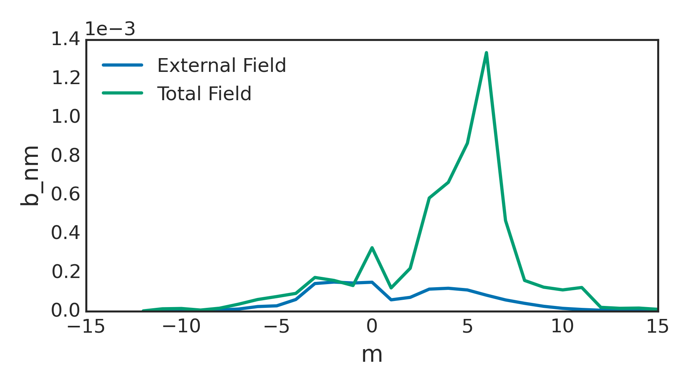

Outputs and Post-Processing
***************************

Spectra
========

Helicity
---------

The GPEC package uses a right handed magnetic coordinate system decomposed in exp(-i(m*theta+n*phi)). This means that the pitch-aligned field will always be positive m. For example, the figure below shows a that the positive m fields are magnified for a DIII-D example control surface.

This convention makes in-house analysis nice and easy. For example, one can *always* plot the m=2 perturbed field profile and see the resonant surface behavior at q=2. The convention does require some awareness from the user when interfacing with other codes though.

To facilitate interfacing with other codes that may have different handedness conventions, the helicity is included in the ipec_control_output_n#.nc file. The helicity is defined as +1 for right handed plasmas in which Bt and Ip are in the same direction, and -1 for left handed plasmas in which Bt and Ip are apposed. As a practical example, interfacing with the right-handed SURFMN code would require using m_surfmn=-m and b_surfmn=(Re(b_m),helicity*Im(b_m)).

Coordinates
-----------

The DCON working coordinate system is used for nearly all calculations in the GPEC package, but the results may be converted to different coordinates specified by jac_out, tmag_out, and jsurf_out.

The ipec_control_output_n#.out netcdf file gives spectral quantities in the working coordinates (specified in the 'jacobian' attribute). It also provides a J_out matrix. The dot product of this matrix and the b or xi spectra will convert the the output coordinates, reproducing the final table of the ipec_control_n#.out ascii output. Note that the same transformation cannot be safely made for other weighted quantities.

Output Files
============

The IPEC outputs are entirely specified by flags (bool types t or f) set in the IPEC_output section of IPEC.in. All outputs are ASCII files, and can be grouped into two major categories.

ASCII File Outputs
------------------

A number of the flag options in IPEC.in instruct IPEC to output ASCII file data. Some of these outputs are always available. Some, however, require a input error field instead of a hard coded harmonic_flag call. Both groups are listed in detail here.

Outputs Always Available

These IPEC outputs can always be obtained from a equil.bin file output from DCON. 

IPEC_response_n#.out

    **Flag** resp_flag

    **Info** Energy for DCON eigenmodes and stability indices. Eigenvalues and eigenvectors for vacuum and plasma inductance (virtual casing currents to fields), plasma permeability (external fields to total fields), and plasma reluctance.

IPEC_singcoup_matrix_n#.out

    **Flag** singcoup_flag

    **Info** The coupling matrix to resonant fields, coupling matrix to singular currents, and to island half-widths is given for each rational surface within the plasma (q=2, 3, etc) for each surface the real and imaginary coupling constants are given for each poloidal mode number on the control surface.

IPEC_singcoup_svd_n#.out

    **Flag** singcoup_flag

    **Info** The SVD singular values (s) and eigen vectors for each coupling matrix in IPEC_singcoup_matrix_n#.out. Large s corresponds to large amplification, with the largest (most important mode) listed at the top. The results should be dotted with the unweighted normal field spectrum to give physical meaning.

Outputs Available When Error Field is Provided

These outputs are only available when an external error field file is provided as an input to IPEC. This means IPEC.in must have the data_flag turned on and a infile specified.

IPEC_control_n#.out

    **Flag** 

    **Info** The Plasma response for an external perturbation on the control surface. This includes the vacuum energy, surface energy, plasma energy, real and imaginary vacuum input \mathbf{B}_{in} and total field on plasma boundary\mathbf{B}_{out}as a function of poloidal mode number.

IPEC_singfld_n#.out

    **Flag** singfld_flag

    **Info** The \Psi_{N}, total resonant \mathbf{B} (real and imaginary), singular current (real and imaginary), island half width in units of normalized flux and Chirikov parameter at rational surface inside the plasma. 

    **Flag** singcoup_flag

    **Info** Additional section showing the overlap field and overlap percentage for each eigenmode in the singcoup_svd output.

IPEC_pmod_n#.out

    **Flag** pmodb_flag

    **Info** Eulerian and Lagrangian \left|\mathbf{B}\right|(real and imaginary) for each poloidal mode number at each value of \Psi_{N} output. This output is necessary for NTV post processing.

IPEC_xbnormal_n#.out

    **Flag** xbnormal_flag

    **Info** The normal components of the displacement, magnetic field without the plasma response, and magnetic field with the plasma response included for each poloidal mode number at each value of \Psi_{N} output.??

IPEC_*rzphi_n#.out

A number of output files have a similar structure. Here the * in the file name is replaced by the appropriate leading letters of the corresponding flag. For example the xrzphi_flag for n=1 creates a IPEC_xrzphi_n1.out file. some common properties of these files are:

• real and imaginary components: Output files contain two dimensional data on an \left(r,z\right) grid for a single toroidal harmonic. To translate into three dimensions, perform the transformationB\left(r,z,\phi\right)=B_{real}\left(r,z\right)\cos\left(n\phi\right)+B_{imag}\left(r,z\right)\sin\left(n\phi\right)
 

• l parameter: 1 designates points inside plasma, 0 points in vacuum, -1 points near/on surface (singularity)

    **Flag** eqbrzphi_flag

    **Info** The original equilibrium field on a \left(r,z,\phi\right) grid.

    **Flag** brzphi_flag

    **Info** The \left(r,z,\phi\right)components of the perturbed magnetic fields inside the plasma on the \left(r,z,\phi\right) grid.

    **Flag** xrzphi_flag

    **Info** The displacement on the \left(r,z,\phi\right) grid.

    **Flag** vbrzphi_flag

    **Info** The false perturbed magnetic field in the vacuum region on the \left(r,z,\phi\right) grid calculated using the IPEC boundary surface current composed of both the vacuum component and the plasma response.

    **Flag** vpbrzphi_flag

    **Info** The true perturbed magnetic field in the vacuum region on the \left(r,z,\phi\right) grid due to the plasma response alone calculated from the plasma response surface condition.

    **Flag** vvbrzphi_flag

    **Info** The false perturbed magnetic field in the vacuum region on the \left(r,z,\phi\right) grid calculated using the IPEC boundary surface current from the external fields alone.

    **Flag** ssbrzphi_flag

    **Info** The false perturbed magnetic field in the vacuum region on the \left(r,z,\phi\right) grid calculated using the IPEC boundary surface current from the external fields alone.

Binary File Outputs
-------------------

These files are designed for quick and easy visualization of results using the xdraw command. For more details on using xdraw see the devoted section on this page.

xbnormal.bin

    **Flag** bin_flag

    **Info** The normal displacement and magnetic field as functions of \Psi_{N} for xdraw.

xbnormal_2d.bin

    **Flag** bin_2d_flag

    **Info** Contour profiles of the normal displacement and magnetic field in (R,z) for xdraw.

pflux_re(im)_2d.bin

    **Flag** bin_2d_flag

    **Info** Contour profiles of the real (imaginary) perturbed flux in (R,z) for xdraw.

bnormal_spectrum.bin

    **Flag** bin_flag

    **Info** Surfmn type contours of the normal perturbed magnetic fields as a function of poloidal harmonic number and \Psi_{N}.

xdraw
=====

The binary IPEC outputs can be viewed using the commandxdraw filenamewhere filename is one of the .bin files created by IPEC (“.bin” excluded). This is a quick way to view results immediately as they are produced. The xdraw tool provides a highly interactive environment that takes keystroke inputs to change plot display options, navigate plots, display single or multiple responses at once, do limited post processing (get a gradient, or ratio), and save figures. For a full list of the command options, enter the xdraw environment and press “k”.
